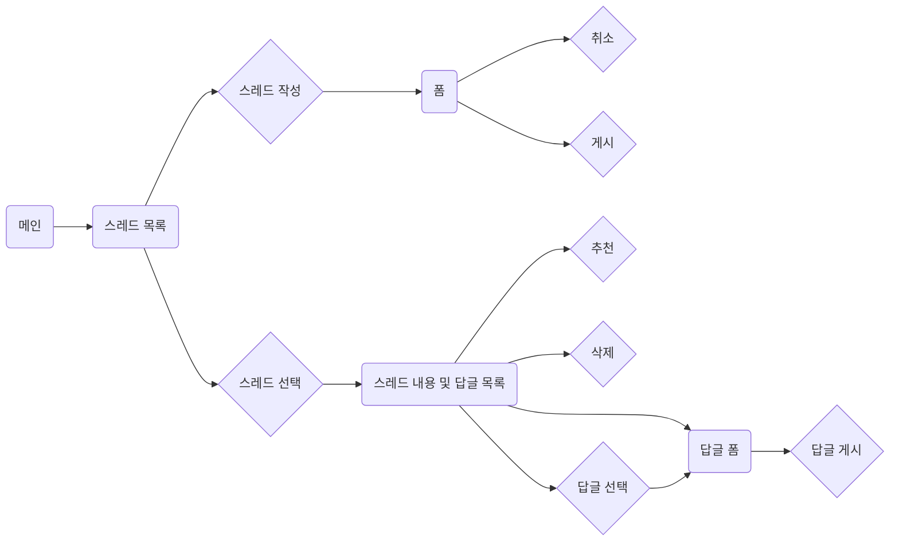

# Thread 방식 게시판

```mermaid
  flowchart LR;
      st(메인)-->id1(스레드 목록)-->id2-1{스레드 작성}-->id3(폼);
      id3(폼)-->id4-1{취소}; id3(폼)-->id4-2{게시};
      id1-->id2-2{스레드 선택}-->id5(스레드 내용 및 답글 목록)-->id6(답글 폼)-->id7{답글 게시};
      id5-->id6-2{추천}; id5-->id6-3{삭제}
      id5-->id5-2{답글 선택}-->id6;
```
